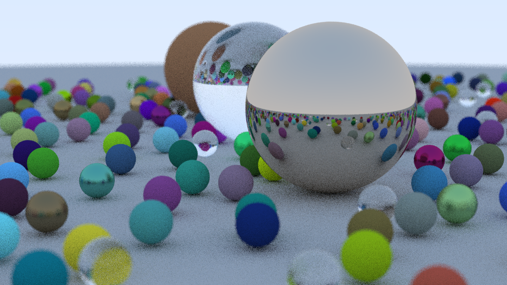

# Ray Tracing in One Weekend

A C++ raytracer from the book [*Ray Tracing in One Weekend*](https://raytracing.github.io/books/RayTracingInOneWeekend.html)
by Peter Shirley, Trevor David Black, and Steve Hollasch.

## Ray Tracer

The raytracer renders a scene containing spheres with lambertian, metal, and dielectric materials.
It contains features such as defocus blur, antialiasing, and positionable camera.
It also takes advantage of multiple CPU cores by splitting up pixel sampling work to improve render time.

## Step by step instructions
1. Clone or download the repository
2. Build the project in cmake
3. Run the program with command line or terminal: `./raytracer > image.ppm`
